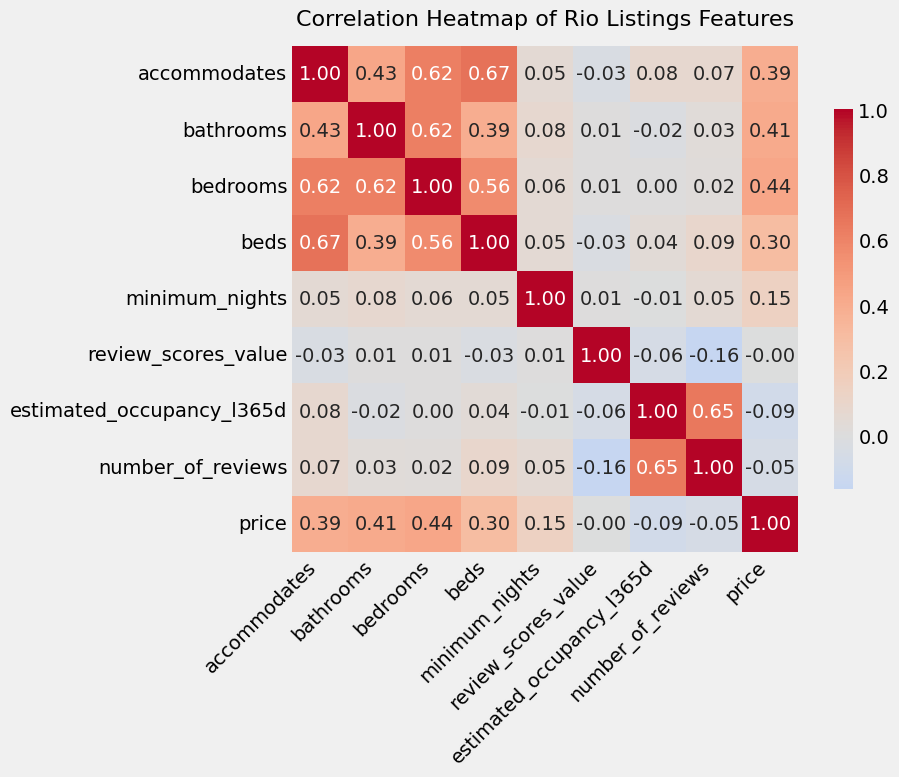
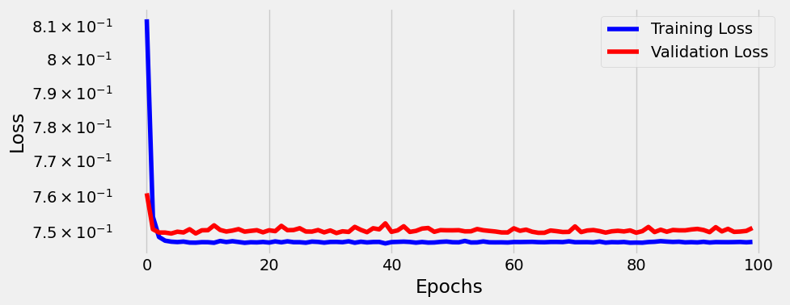
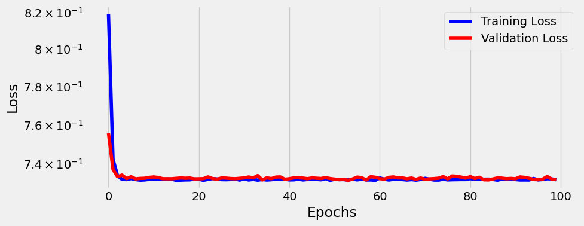
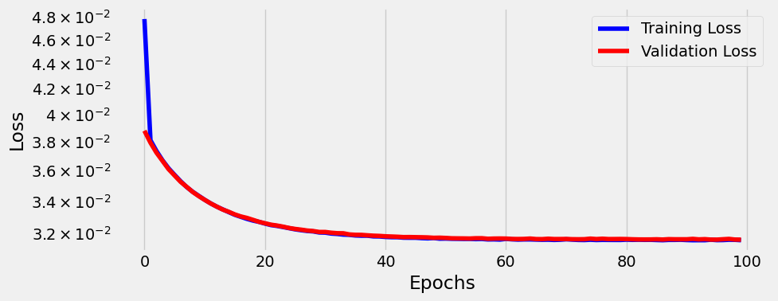
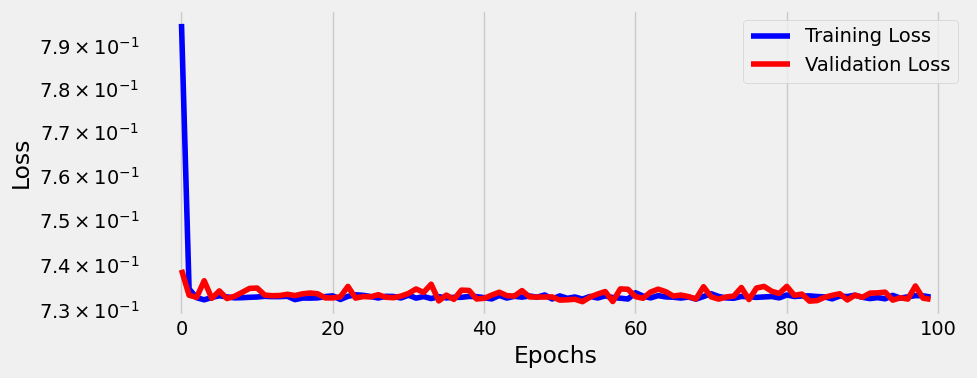
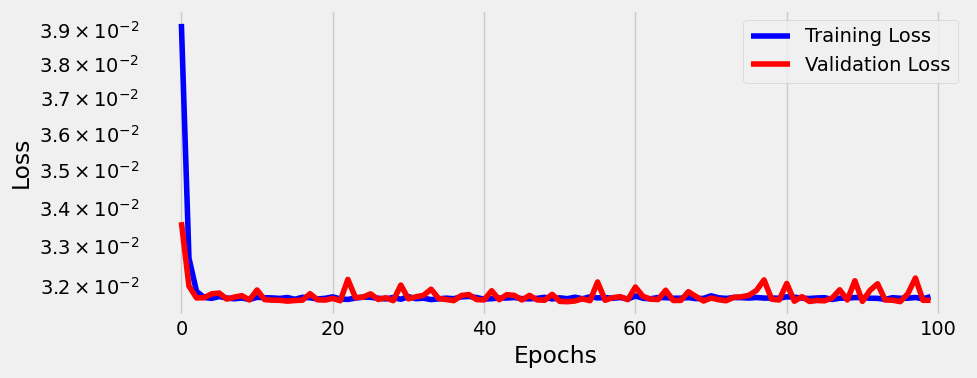

## Airbnb Price Prediction with Machine Learning

Este projeto tem como objetivo prever o preço de diárias de imóveis do Airbnb a partir de informações sobre as propriedades, como número de quartos, tipo de imóvel e localização.
O trabalho foi desenvolvido como parte de um estudo em MLOps e aprendizado de máquina aplicado a dados reais.
Para o projeto foi utilizado como base o notebook fornecido pelo professor [Ivanovitch Silva](https://github.com/ivanovitchm/mlops/blob/main/lessons/week03/lesson04.ipynb).

Objetivos especificos:

- Melhorar o EDA e seleção/criação de features
- Diferentes formas de normalização (e.g: min-max)
- Modificação do algoritmo de otimização (e.g: adam, nadam, etc)

## Passos

### Pré-prossessamento dos dados:

Primeiro foi feito a analise exploratória dos dados para obter as features do modelo. Foi feita uma limpeza do dataset criando um novo com apenas features numericas e sem dados faltantes. Além de tornar nossa target, que é a variavél price em um valor numerico.

```
numeric_df = numeric_df.dropna(axis=0)
numeric_df.info()
```

```
<class 'pandas.core.frame.DataFrame'>
Index: 30292 entries, 2 to 41946
Data columns (total 38 columns):
 #   Column                                        Non-Null Count  Dtype
---  ------                                        --------------  -----
 0   latitude                                      30292 non-null  float64
 1   longitude                                     30292 non-null  float64
 2   accommodates                                  30292 non-null  int64
 3   bathrooms                                     30292 non-null  float64
 4   bedrooms                                      30292 non-null  float64
 5   beds                                          30292 non-null  float64
 6   price                                         30292 non-null  float64
 7   minimum_nights                                30292 non-null  int64
 8   maximum_nights                                30292 non-null  int64
 9   minimum_minimum_nights                        30292 non-null  int64
 10  maximum_minimum_nights                        30292 non-null  int64
 11  minimum_maximum_nights                        30292 non-null  int64
 12  maximum_maximum_nights                        30292 non-null  int64
 13  minimum_nights_avg_ntm                        30292 non-null  float64
 14  maximum_nights_avg_ntm                        30292 non-null  float64
 15  availability_30                               30292 non-null  int64
 16  availability_60                               30292 non-null  int64
 17  availability_90                               30292 non-null  int64
 18  availability_365                              30292 non-null  int64
 19  number_of_reviews                             30292 non-null  int64
...
 36  calculated_host_listings_count_shared_rooms   30292 non-null  int64
 37  reviews_per_month                             30292 non-null  float64
dtypes: float64(17), int64(21)
memory usage: 9.0 MB
```

Em seguida foi feita a correlação para identificar as possivéis features que entraram no modelo.

```
corr_with_price = corr_matrix["price"].sort_values(ascending=False)
print(corr_with_price)
```

```
price                                           1.000000
estimated_revenue_l365d                         0.166712
bathrooms                                       0.113558
bedrooms                                        0.108686
accommodates                                    0.094711
beds                                            0.066152
availability_365                                0.027019
availability_eoy                                0.024764
availability_60                                 0.024288
minimum_minimum_nights                          0.022537
availability_30                                 0.020262
availability_90                                 0.020060
minimum_nights_avg_ntm                          0.019870
minimum_nights                                  0.018440
maximum_minimum_nights                          0.014469
review_scores_location                          0.009490
calculated_host_listings_count_entire_homes     0.006727
calculated_host_listings_count                  0.004468
review_scores_checkin                           0.002105
longitude                                       0.000789
review_scores_rating                           -0.001081
maximum_nights                                 -0.001795
review_scores_cleanliness                      -0.005021
review_scores_communication                    -0.007348
review_scores_accuracy                         -0.007816
...
estimated_occupancy_l365d                      -0.038285
number_of_reviews_l30d                         -0.038711
reviews_per_month                              -0.042737
```

Analisando esse valores foram escolhidas as seguintes features.

```
target_columns = [
    "accommodates",      # Number of guests the property can host
    "bathrooms",         # Number of bathrooms available
    "bedrooms",          # Number of bedrooms available
    "beds",              # Number of beds available
    "minimum_nights",    # Minimum nights required for a booking
    "review_scores_value",
    "estimated_occupancy_l365d",
    "number_of_reviews", # Total reviews given by past guests
    "price"              # Nightly rental price
]
```

Escolhidas as features foi criado um novo dataset e feito o seu tratamento. Removendo outliers e obtivemos a seguinte tabela de correlação.


## Pipeline do modelo

**1**. Extração da features (X) e da target (y) do DataFrame

**2**. Construção dos tensor antes da divisão entre treinamento/teste.

**3**. Divisão entre treinamento e validação usando Pytorch split

**4**. Recriação do DataLoader com os valores normalizados. Para isso foi utilizado dois tipos de normalização: Z-score e Min-Máx.

**5**. Por fim a configuração do modelo
escolhendo tipo de função, o otimizador, que foram dois o SGD e o Adam, e a função de perda que foi MSE.

## Resultados

Após esse procedimento foi feito o treinamento do modelo, o teste para novas entradas e sua avaliação através das métricas MSE,RMSE, MAE e R2. O objetivo era obter métricas melhores que a referência incial fornecida pelo professor.

## Resultado de referência

Gráfico de referência no qual foi utilizado o otimizador SGD e a normalização Z-score:


E as seguintes métricas:

```
Evaluation Metrics (Z-score Normalization):
Mean Squared Error (MSE) on validation set: 40895.58
Root Mean Squared Error (RMSE) on validation set: 202.23
Mean Absolute Error (MAE) on validation set: 152.42
R-squared (R2) on validation set: 0.23
```

### Para o otimizador SGD com a normalização Z-score

Obtivemos o seguinte gráfico de erro:


E as seguintes métricas:

```
Evaluation Metrics (Z-score Normalization):
Mean Squared Error (MSE) on validation set: 28486.44
Root Mean Squared Error (RMSE) on validation set: 168.78
Mean Absolute Error (MAE) on validation set: 128.99
R-squared (R2) on validation set: 0.26
```

### Para o otimizador SGD com a nomalização Min-Máx

Obtivemos o seguinte gráfico:


E as seguintes métrica:

```
Evaluation Metrics (Min-Max Normalization):
Mean Squared Error (MSE) on validation set: 28490.79
Root Mean Squared Error (RMSE) on validation set: 168.79
Mean Absolute Error (MAE) on validation set: 128.63
R-squared (R2) on validation set: 0.26
```

### Para o otimizador Adam com Z-score

Obtivemos o seguinte gráfico:


E as seguintes métricas:

```
Evaluation Metrics (Z-score Normalization):
Mean Squared Error (MSE) on validation set: 28487.71
Root Mean Squared Error (RMSE) on validation set: 168.78
Mean Absolute Error (MAE) on validation set: 128.61
R-squared (R2) on validation set: 0.26
```

### Para o otimizador Adam com Min-Máx

Obtivemos o seguinte gráfico:


E as seguintes métricas:

```
Evaluation Metrics (Min-Max Normalization):
Mean Squared Error (MSE) on validation set: 28503.67
Root Mean Squared Error (RMSE) on validation set: 168.83
Mean Absolute Error (MAE) on validation set: 127.77
R-squared (R2) on validation set: 0.26
```

Por fim, foi feita a comparação com a utilização da biblioteca [Lazy Predict](https://github.com/shankarpandala/lazypredict).

## Resultados dos modelos do Lazy Predict

| Model                         | Adjusted R-Squared | R-Squared |     RMSE | Time Taken |
| :---------------------------- | -----------------: | --------: | -------: | ---------: |
| GradientBoostingRegressor     |               0.31 |      0.31 |   164.63 |       1.23 |
| HistGradientBoostingRegressor |               0.30 |      0.30 |   165.57 |       0.25 |
| LGBMRegressor                 |               0.30 |      0.30 |   165.60 |       0.24 |
| MLPRegressor                  |               0.30 |      0.30 |   166.30 |      10.46 |
| LassoLarsIC                   |               0.27 |      0.27 |   169.20 |       0.05 |
| LinearRegression              |               0.27 |      0.27 |   169.20 |       0.06 |
| Lars                          |               0.27 |      0.27 |   169.20 |       0.04 |
| LassoLarsCV                   |               0.27 |      0.27 |   169.20 |       0.08 |
| LarsCV                        |               0.27 |      0.27 |   169.20 |       0.06 |
| TransformedTargetRegressor    |               0.27 |      0.27 |   169.20 |       0.03 |
| Ridge                         |               0.27 |      0.27 |   169.20 |       0.02 |
| RidgeCV                       |               0.27 |      0.27 |   169.21 |       0.04 |
| BayesianRidge                 |               0.27 |      0.27 |   169.21 |       0.06 |
| LassoCV                       |               0.27 |      0.27 |   169.21 |       0.13 |
| SGDRegressor                  |               0.27 |      0.27 |   169.22 |       0.10 |
| LassoLars                     |               0.27 |      0.27 |   169.31 |       0.03 |
| Lasso                         |               0.27 |      0.27 |   169.31 |       0.03 |
| ElasticNetCV                  |               0.27 |      0.27 |   169.37 |       0.14 |
| OrthogonalMatchingPursuitCV   |               0.27 |      0.27 |   169.40 |       0.04 |
| PoissonRegressor              |               0.26 |      0.26 |   170.20 |       0.08 |
| ElasticNet                    |               0.26 |      0.26 |   170.97 |       0.02 |
| XGBRegressor                  |               0.25 |      0.26 |   171.10 |       0.26 |
| HuberRegressor                |               0.25 |      0.25 |   171.83 |       0.14 |
| TweedieRegressor              |               0.24 |      0.24 |   172.98 |       0.05 |
| GammaRegressor                |               0.23 |      0.23 |   173.47 |       0.05 |
| NuSVR                         |               0.23 |      0.23 |   173.54 |      20.41 |
| LinearSVR                     |               0.23 |      0.23 |   174.19 |       0.06 |
| AdaBoostRegressor             |               0.23 |      0.23 |   174.22 |       0.29 |
| PassiveAggressiveRegressor    |               0.21 |      0.21 |   175.79 |       0.04 |
| RandomForestRegressor         |               0.21 |      0.21 |   175.80 |       6.01 |
| SVR                           |               0.21 |      0.21 |   176.30 |      19.83 |
| OrthogonalMatchingPursuit     |               0.20 |      0.20 |   177.23 |       0.02 |
| KNeighborsRegressor           |               0.17 |      0.17 |   180.15 |       0.31 |
| BaggingRegressor              |               0.16 |      0.16 |   181.51 |       0.63 |
| ExtraTreesRegressor           |               0.14 |      0.14 |   183.98 |       4.36 |
| RANSACRegressor               |               0.06 |      0.06 |   191.84 |       0.16 |
| DummyRegressor                |              -0.00 |     -0.00 |   198.36 |       0.02 |
| QuantileRegressor             |              -0.08 |     -0.08 |   205.72 |      12.12 |
| ExtraTreeRegressor            |              -0.26 |     -0.26 |   222.47 |       0.14 |
| DecisionTreeRegressor         |              -0.35 |     -0.35 |   230.44 |       0.14 |
| KernelRidge                   |              -2.90 |     -2.89 |   391.30 |      29.36 |
| GaussianProcessRegressor      |          -32738.87 | -32676.28 | 35846.39 |     160.09 |
