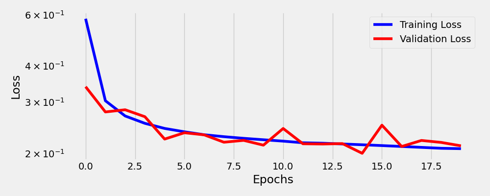
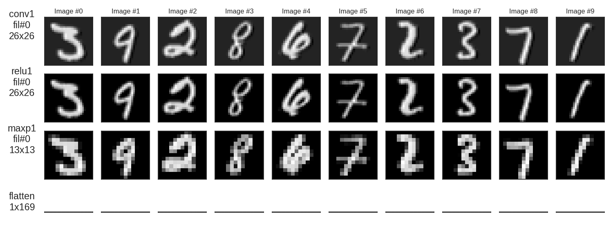
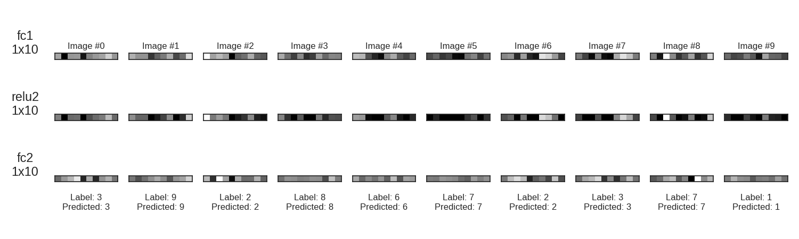

# CNN para Classificação de Dígitos MNIST

## 📋 Descrição

Este projeto implementa uma Rede Neural Convolucional (CNN) para classificação de dígitos manuscritos do dataset MNIST do torchvision. A implementação utiliza PyTorch e inclui uma classe `Architecture` reutilizável que encapsula todo o pipeline de treinamento, validação e visualização. Para esse projeto foi utilizado o notebook base fornecido pelo professor [Ivanovitch Silva](https://github.com/ivanovitchm/mlops/blob/main/lessons/week06/Week06.ipynb).

## 🎯 Objetivos

- Treinar uma CNN para classificar dígitos de 0 a 9
- Visualizar filtros convolucionais e feature maps
- Avaliar o desempenho do modelo através de métricas de acurácia

## 🛠️ Tecnologias Utilizadas

- **Python 3.x**
- **PyTorch** - Framework de deep learning
- **Torchvision** - Datasets e transformações
- **NumPy** - Operações numéricas
- **Matplotlib** - Visualizações
- **PIL** - Processamento de imagens

## 🏗️ Arquitetura do Modelo

### Estrutura da CNN

```

Input (1x28x28)
↓
Conv2D (1→1, kernel=3x3)
↓
ReLU
↓
MaxPool2D (2x2)
↓
Flatten (1x13x13 → 169)
↓
Linear (169→10)
↓
ReLU
↓
Linear (10→10)
↓
Output (10 classes)

```

### Parâmetros de Treinamento

- **Batch Size**: 64
- **Learning Rate**: 0.1
- **Optimizer**: SGD (Stochastic Gradient Descent)
- **Loss Function**: CrossEntropyLoss
- **Epochs**: 20
- **Device**: CUDA (se disponível) ou CPU

## 📚 Dataset MNIST

- **Training samples**: 60,000 imagens
- **Test samples**: 10,000 imagens
- **Dimensões**: 28x28 pixels (grayscale)
- **Classes**: 10 (dígitos 0-9)
- **Download**: Automático via torchvision

## 📈 Resultados

O modelo é avaliado usando a função Loss para treinamento e validação, além da acurácia:

### 1. Loss



### 2. Acurácia

O modelo teve uma porcentagem de predições corretas de 94%.

## 🎨 Visualizações

Com a utilização de Hooks para captar ativações intermediárias é possivel visualizar as feature maps de todas as camadas:




## 📊 Análise

As camadas convolucionais transformam a imagem de forma progressiva, partindo de detalhes simples até padrões complexos. Nas primeiras camadas, os filtros capturam bordas e contrastes básicos, ressaltando contornos da imagem original. Nas camadas intermediárias, surgem padrões mais abstratos, como texturas e formas combinadas. Nas camadas mais profundas, as ativações tornam-se mais refinadas, destacando regiões que representam partes ou conceitos relevantes para a decisão final do modelo.

## 📹 Vídeo de Apresentação

[Link do vídeo demonstrativo]()
